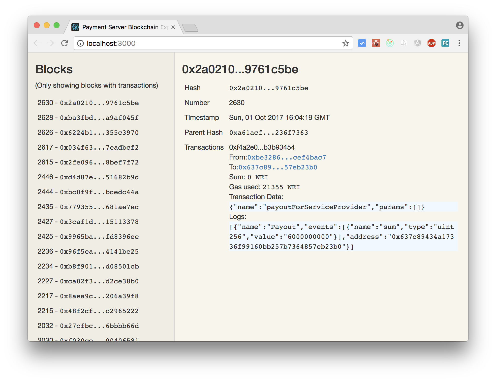

# Visualizer

This is a tool to investigate the state of a blockchain in regards to the Payment System.



## Running It

- Configure the address of the ethereum node to which the visualizer shall connect in src/AppModule.ts.
- Run `yarn install` to install node dependencies.
- Build and start the server via `yarn run start`.
- Visit `http://locolhost:3000` in your browser.

## Testing It

To run the unit tests execute:
 
```
npm run test
```
